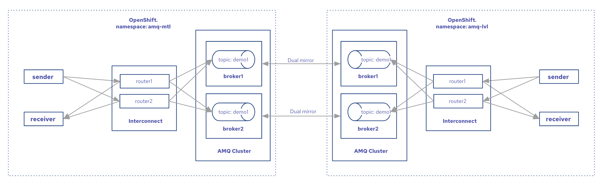

# AMQ HA and DR on OpenShift

## Architecture

1. Two namespaces in Openshift
2. Two brokers AMQ cluster in each namespace
3. Two Interconnect routers in each namespace
4. Topic `demo1` in each broker
5. Dual mirror (Disaster recovery) configuration of brokers [ActiveMQ Broker Connections](https://activemq.apache.org/components/artemis/documentation/latest/amqp-broker-connections.html#mirror)



## How to
### Prerequisites
OpenShift 4.10 up and running

### Deployment
1. Login to OpenShift
```bash
oc login https://host:port
```
2. Create namespaces `amq-mtl` and `amq-lvl`. Install operators
```
oc apply -k operators
```
3. Create brokers `amq-mtl` and `amq-lvl` with `demo1` topic address in corresponding namespaces 
```
oc apply -k brokers
```
### Deploy applications
1. Sender
```
cd client-amqp
mvn clean package -Dnamespace=amq-mtl -Dname=amqp-sender
```
2. Receiver
```
cd client-amqp
mvn clean package -Dnamespace=amq-mtl -Dname=amqp-receiver
```
